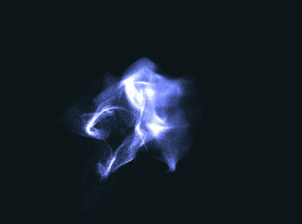

# OpenCL-OpenGL Particle System

An example of combining OpenCL and OpenGL to render a large number of particles simulated on the GPU at interactive frame rates.

Particle attributes are calculated on the GPU using OpenCL, with velocity influenced by a vector field. They are then rendered by OpenGL. Millions of particles can be rendered at interactive frame rates.

## Getting Started

This project has currently only been built and tested on macOS.

### Prerequisites
Make sure the following dependancies are installed:
  + [OpenCL-OpenGL Framework](https://gitlab.com/BrassLion/opencl-opengl-framework)
  + [GLEW](https://github.com/nigels-com/glew)
  + [NanoGUI](https://github.com/wjakob/nanogui)
  + [Eigen](https://bitbucket.org/eigen/eigen/)
  + [GLM](https://github.com/g-truc/glm)
  + [Boost - Filesystem](http://www.boost.org/)

Most dependancies can be downloaded using Homebrew.

### Installing
- Download or clone the repository.
- Open the enclosed project in Xcode.

## Licensing
This project is licensed under the MIT license.

## Visualisations

*1 million particles influenced by a vector field. A quiver plot of the vector field is also drawn.*

*1 million particles influenced by a vector field.*
